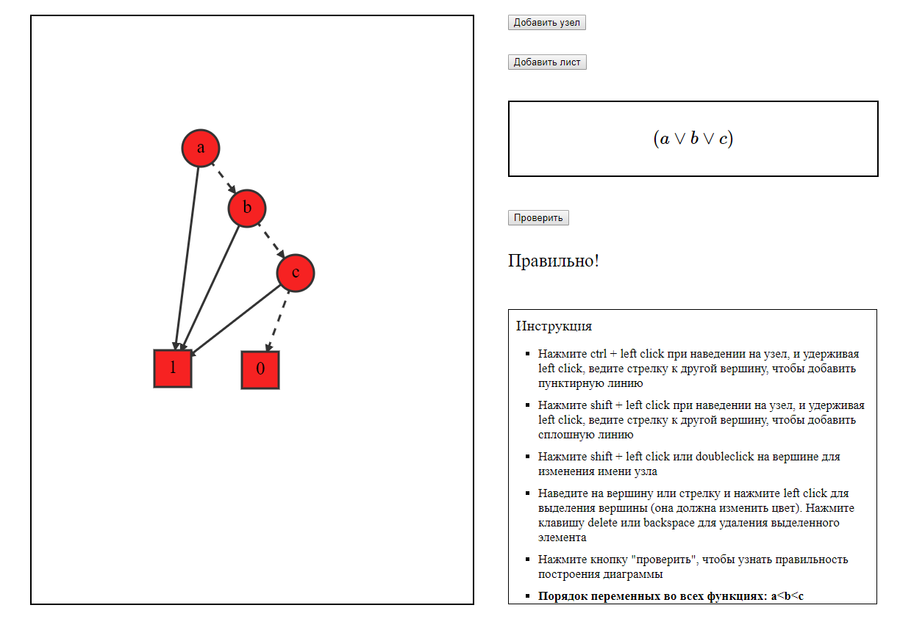

## BDD creator
That small web app allows you to build binary decision diagram based on given logic formula. 
Then program checks if all have been done right.

### Installation
* clone this project
* install requirements:
```pip install -r requirements.txt```
* run server:
``` python flask_server/FlaskServer.py```
* app will be available on ```localhost:5000```

### Example
